## Repositório de Algoritmos em C

Este repositório é dedicado ao aprendizado de algoritmos utilizando a linguagem C.

## Requisitos

- Visual Studio Code - <https://code.visualstudio.com/download>


## Sumário

1. [Instalação do MSYS2](#instalação-do-msys2)
2. [Usando GCC no VSCode](#usando-gcc-no-vscode)
3. [Hello World em C](#hello-world-em-c)

## Instalação do MSYS2

Para compilar e executar programas em C no Windows, recomenda-se utilizar o MSYS2, que fornece um ambiente Unix-like e ferramentas essenciais como o GCC. O terminal recomendado é o **MSYS2 UCRT64**.

---

## 1. Acesse o site oficial: <https://www.msys2.org/>

## 2. Baixe o instalador adequado para o seu sistema

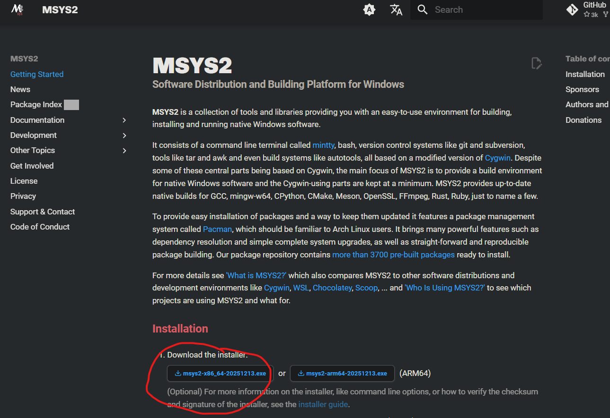

## 3. Execute o instalador `.exe` baixado

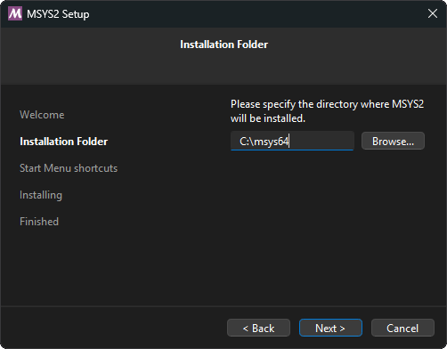

## 4. Escolha a pasta de instalação. Recomenda-se deixar a pasta padrão, pois você precisará saber esse caminho depois

## 5. Após instalar, abra o menu iniciar, pesquise por **msys2** e selecione o terminal **MSYS2 UCRT64** (ícone amarelo)

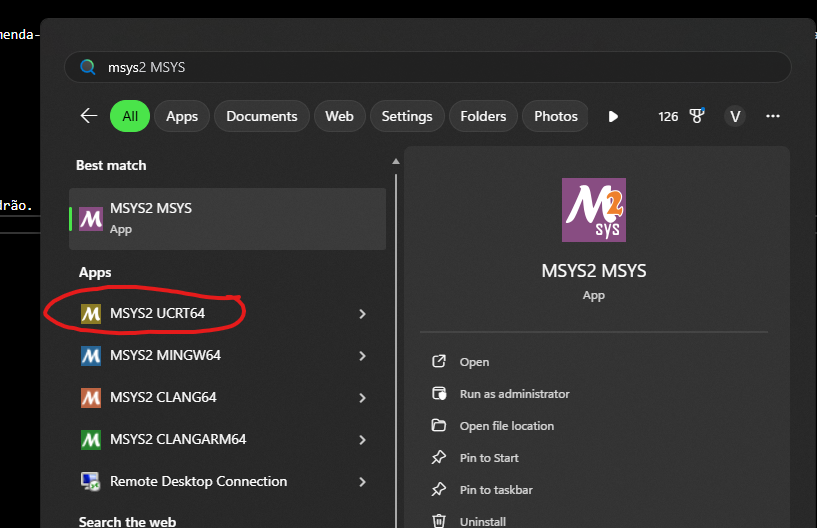

## 6. O terminal será aberto, semelhante a este

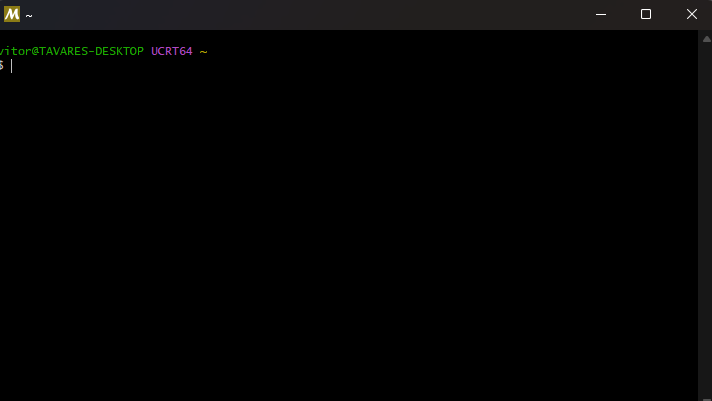

## 7. No terminal **MSYS2 UCRT64**, instale o GCC com o comando abaixo

```bash
pacman -S mingw-w64-ucrt-x86_64-gcc
```

> Para colar no terminal, use **Shift+Insert** ou clique com o botão direito do mouse e selecione "Colar".

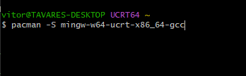

## 8. Confirme a instalação digitando `Y` e pressionando Enter quando solicitado

```bash
:: Proceed with installation? [Y/n]
```

## 9. Após a instalação, verifique se o GCC está funcionando

```bash
gcc --version
```

> O resultado esperado é algo assim:

```bash
$ gcc --version
gcc.exe (Rev8, Built by MSYS2 project) 15.2.0
Copyright (C) 2025 Free Software Foundation, Inc.
This is free software; see the source for copying conditions.  There is NO
warranty; not even for MERCHANTABILITY or FITNESS FOR A PARTICULAR PURPOSE.
```

## 10. Para usar o GCC fora do terminal MSYS2, adicione o caminho do UCRT64 à variável de ambiente **PATH** do Windows
>
> Pesquise por "variáveis de ambiente" no menu iniciar e clique para editar as variáveis de ambiente do sistema.

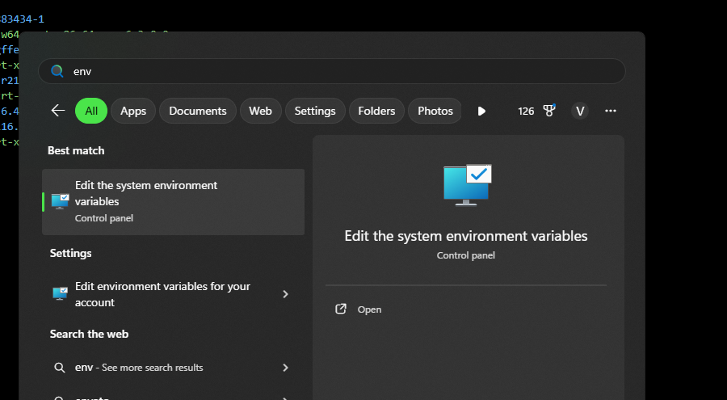

> Clique no botão para editar as variáveis:

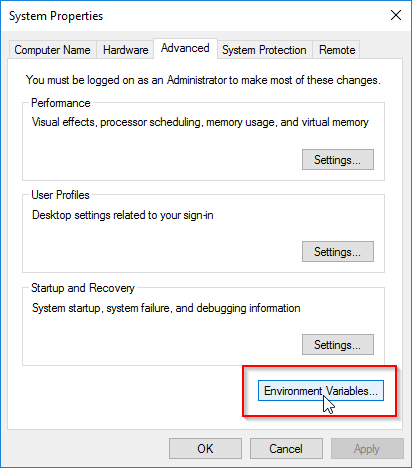

> Na tabela de baixo, selecione o campo **Path** e clique em **Editar**:

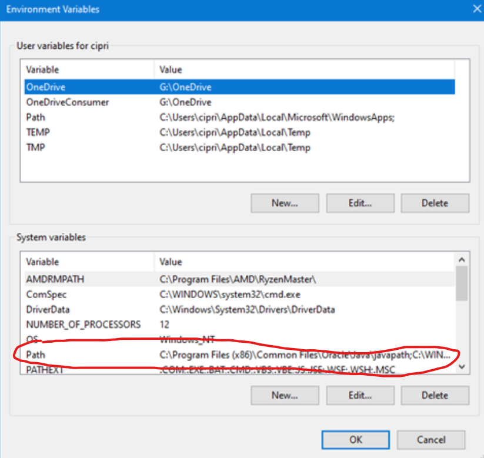

> Clique em **Novo** e adicione o caminho:

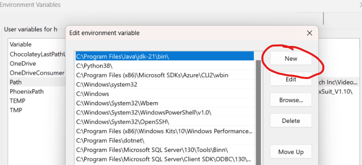

```
C:\msys64\ucrt64\bin
```

> Se instalou em outra pasta, ajuste o caminho conforme necessário: `C:\SUA-PASTA\ucrt64\bin`

> Confirme com OK, OK novamente e aplique se necessário.

## 11. Abra um novo terminal do Windows, digite

```bash
gcc --version
```

> O resultado deve ser o mesmo apresentado anteriormente, confirmando que o GCC está disponível globalmente.

## Usando GCC no VSCode


### Para compilar e executar programas em C diretamente no Visual Studio Code, siga estes passos:

### 1. Abra o Visual Studio Code, clique no ícone de engrenagem no canto inferior esquerdo e acesse "Configurações":

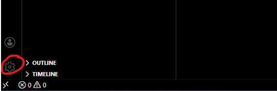

### 2. Acesse a seção de perfis:

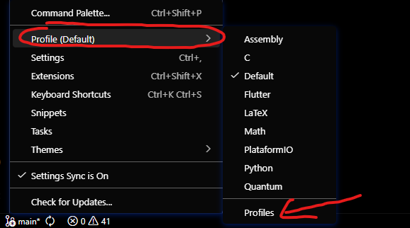

### 3. Crie um novo perfil chamado "C":

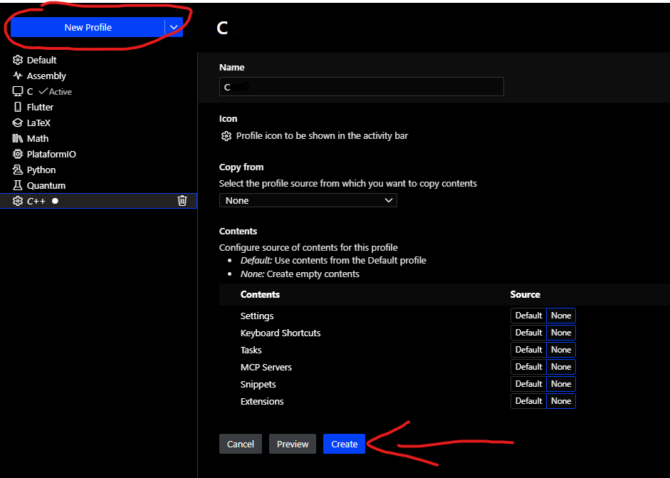

### 4. No menu de extensões (ícone de quadrados à esquerda), pesquise e instale a extensão "C/C++" da Microsoft:

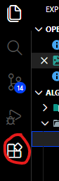

### 5. Instale também as extensões "C/C++" e "Code Runner":
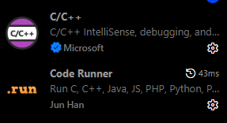

## Hello World em C

### Crie um arquivo chamado `hello.c` com o seguinte código:

```c
#include <stdio.h>

int main() {
    printf("Hello World!\n");
    return 0;
}
```

### Para compilar e executar, clique no botão de play no canto superior direito do VSCode e escolha a opção "Run Code":
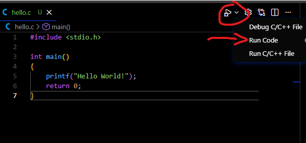

### O resultado esperado será semelhante a este:
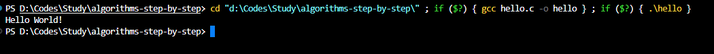